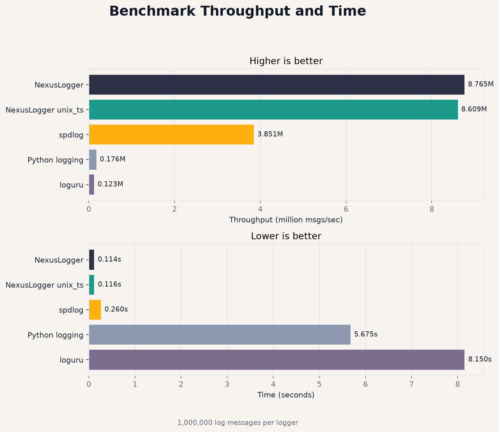

# NexusLog


高性能异步日志库，兼容 Python 标准 logging API。

[English](README.md)

## 性能测试

<p align="center">
  
</p>

```
Benchmarking with 1,000,000 log messages

------------------------------------------------------------
Logger               Time (s)     Msgs/sec        Log size
------------------------------------------------------------
loguru               8.150        122,696         89,888,890 bytes
Python logging       5.675        176,226         82,888,890 bytes
spdlog               0.260        3,850,774       79,888,890 bytes
NexusLogger unix_ts  0.116        8,608,575       85,888,890 bytes
NexusLogger          0.114        8,765,093       97,888,890 bytes
------------------------------------------------------------

NexusLogger is 49.74x faster than Python logging
NexusLogger is 71.44x faster than loguru
NexusLogger is 2.28x faster than spdlog
NexusLogger unix_ts is 48.85x faster than Python logging
NexusLogger unix_ts is 70.16x faster than loguru
NexusLogger unix_ts is 2.24x faster than spdlog
```

## 安装

```bash
pip install nexuslog
```

## 快速开始

```python
import nexuslog as logging

logging.basicConfig(level=logging.INFO)

logging.info("Hello, world!")
logging.warning("This is a warning")
logging.error("This is an error")
```

## API

### 日志级别

```python
logging.TRACE
logging.DEBUG
logging.INFO
logging.WARNING
logging.ERROR
```

### 模块级函数

```python
logging.basicConfig(filename=None, level=logging.INFO, unix_ts=False)
logging.basicConfig(
    level=logging.INFO,
    name_levels={"db": logging.DEBUG, "http.client": logging.WARNING},
)
logging.trace(message)
logging.debug(message)
logging.info(message)
logging.warning(message)
logging.error(message)
```

### Logger 类

```python
from nexuslog import Logger, Level

logger = Logger("myapp", path="/var/log/app", level=Level.Info)
logger.info("message")
logger.shutdown()
```

### getLogger

```python
import nexuslog as logging

logging.basicConfig(filename="/var/log/app.log", level=logging.DEBUG)
logger = logging.getLogger("myapp")
logger.info("message")
```

## License

MIT
